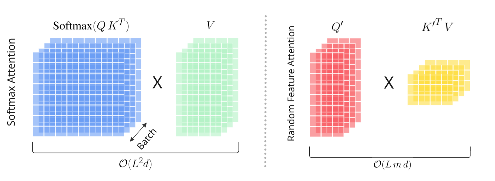

</img>

# Data-Aware Random Feature Kernels for Transformers (DARKformer)

[](https://badge.fury.io/py/darkformer-pytorch)

The `darkformer-pytorch` package provides a PyTorch implementation of the data-aware random feature
kernel described in the [Data-Aware Random Feature Kernel for
Transformers](https://arxiv.org/abs/2603.04127) paper by Google Deepmind. It follows the positive random
feature formulation used by Performer while learning the projection geometry from
data.

Inspiration was taken from lucidrain's [performer-pytorch](https://github.com/lucidrains/performer-pytorch) package to guide the implementation.

## Kernel

For each attention head, DARKformer replaces the usual dot-product kernel with:
<br></br>
```math
\begin{aligned}
\Sigma &= M^\mathsf{T} M \succeq 0, \\
\kappa_\Sigma(q, k) &= \exp\!\left(q^\mathsf{T} \Sigma k\right).
\end{aligned}
```
<br></br>
The public attention modules apply $d_h^{-1/4}$ to both queries and keys. For
unscaled inputs, the evaluated kernel is therefore
<br></br>
```math
\kappa_\Sigma(q, k)
= \exp\!\left(\frac{q^\mathsf{T}\Sigma k}{\sqrt{d_h}}\right).
```
<br></br>
The factorization keeps $\Sigma$ positive semidefinite. For $m$ features with each
$\omega_j$ sampled from a standard Gaussian, the corresponding positive random
feature map is

```math
\phi_\Sigma(x; \omega_j)
= \frac{1}{\sqrt{m}}
  \exp\!\left(
    \omega_j^\mathsf{T} Mx
    - \frac{1}{2} x^\mathsf{T} \Sigma x
  \right),
\qquad
\omega_j \sim \mathcal{N}(0, I).
```
<br></br>
The finite feature map approximates the learned kernel, and normalized attention
can be evaluated associatively:
<br></br>

```math
\mathrm{Att}(Q, K, V)
\approx
\frac{
  \Phi(Q)\left(\Phi(K)^\mathsf{T} V\right)
}{
  \Phi(Q)\left(\Phi(K)^\mathsf{T} \mathbf{1}\right)
}.
```
<br></br>
For sequence length $L$, head dimension $d_h$, and $m$ random features, this ordering
costs $O(L m d_h)$ per head and does not construct the $L \times L$ score matrix.
Exact attention costs $O(L^2 d_h)$. Learning $M$ aligns the sampling covariance with
the query-key geometry, which the paper interprets as an implicit
importance-sampling scheme for reducing Monte Carlo variance.

The learned positive semidefinite kernel and its positive random feature estimator
come from the paper. Runtime mode selection, feature count, redraw timing, exact
attention cutoff, per-head geometry, low-rank geometry, orthogonal feature blocks,
model depth, and backend dispatch are configurable library choices.

## Installation

Install from PyPI:

```bash
python -m pip install darkformer-pytorch
```

For development, install from the repository root:

```bash
python -m pip install -e ".[dev]"
```

PyTorch is the only runtime dependency. [FlashAttention](https://github.com/Dao-AILab/flash-attention)
is optional and should be installed separately for a compatible CUDA, PyTorch,
and GPU environment.

## Self-attention

`DarkformerAttention` is the primary attention API and an alias of
`SelfAttention`.

```python
import torch

from darkformer_pytorch import DarkformerAttention

device = torch.device("cuda" if torch.cuda.is_available() else "cpu")

attention = DarkformerAttention(
    dim=512,
    heads=8,
    head_dim=64,
    num_features=256,
    geometry_rank=64,
    attention_mode="linear",
    causal=True,
).to(device)

x = torch.randn(2, 2048, 512, device=device)
mask = torch.ones(2, 2048, dtype=torch.bool, device=device)
output = attention(x, mask=mask)
```

The input and output shapes are $B \times L \times d$. A boolean `mask` has shape
$B \times L$, where `True` marks a valid token. Causal attention combines the token
mask with the causal constraint.

Set `per_head_geometry=False` to share the learned geometry across heads. Set
`orthogonal_features=False` to use independent Gaussian features instead of
orthogonal Gaussian blocks.

### Attention modes

`attention_mode` controls how the learned kernel is evaluated:

| Mode | Behavior |
| --- | --- |
| `"linear"` | Uses positive random features and associative linear attention. |
| `"exact"` | Evaluates the learned kernel with exact softmax attention. |
| `"auto"` | Uses exact attention through `exact_threshold`, then linear attention. |

For automatic selection, provide the cutoff explicitly:

```python
attention = DarkformerAttention(
    512,
    heads=8,
    attention_mode="auto",
    exact_threshold=1024,
    exact_backend="auto",
).to("cuda")
```

The exact path applies the learned geometry to queries and keys before scaled
dot-product attention. `exact_backend="auto"` attempts FlashAttention 3, then
FlashAttention 2, when an installed backend supports the device, dtype, head
dimension, dropout, causality, and mask. It otherwise uses PyTorch scaled dot-product
attention. Set `exact_backend` to `"flash3"`, `"flash2"`, or `"sdpa"` to request a
specific backend. A forced FlashAttention backend raises an error when its package or
required hardware support is unavailable.

FlashAttention 3 requires an NVIDIA Hopper GPU and CUDA 12.3 or newer.
FlashAttention 2 requires CUDA 12.0 or newer on supported NVIDIA GPUs, or a
supported ROCm environment.

Optional FlashAttention packages are never required to import or run
`darkformer_pytorch`.
FlashAttention only serves the exact learned-kernel path. The linear positive random
feature path has no softmax score matrix for a FlashAttention kernel to compute.

## Cross-attention

`CrossAttention` keeps query and context masks separate. It has no causal or rotary
option because position handling belongs to the surrounding encoder-decoder model.

```python
import torch

from darkformer_pytorch import CrossAttention

cross_attention = CrossAttention(
    dim=512,
    heads=8,
    head_dim=64,
    num_features=256,
    attention_mode="linear",
).to("cuda")

x = torch.randn(2, 256, 512, device="cuda")
context = torch.randn(2, 1024, 512, device="cuda")
mask = torch.ones(2, 256, dtype=torch.bool, device="cuda")
context_mask = torch.ones(2, 1024, dtype=torch.bool, device="cuda")

output = cross_attention(
    x,
    context,
    mask=mask,
    context_mask=context_mask,
)
```

## Projection lifecycle

Random projections stay unchanged unless a redraw is requested. The default
`feature_redraw_interval=None` disables scheduled redraws. A positive interval
redraws after that many training forwards. Evaluation forwards do not advance the
schedule.

All public attention and model modules expose the same in-place lifecycle methods:

```python
attention.redraw_projection_matrices_()
attention.fix_projection_matrices_()
attention.redraw_projection_matrices_(force=True)
attention.unfix_projection_matrices_()
```

Fixed projections ignore ordinary manual and scheduled redraws. Pass `force=True`
for an intentional one-time redraw while fixed. `projection_seed` makes initial
projections reproducible independently of PyTorch's global random state.
`deterministic=True` fixes projection matrices at construction.

For a scheduled training policy:

```python
from darkformer_pytorch import SelfAttention

attention = SelfAttention(
    512,
    num_features=256,
    feature_redraw_interval=1_000,
    projection_seed=7,
)
```

## Mixed precision

Move the module to CUDA and select a model dtype with standard PyTorch operations:

```python
attention = attention.to("cuda", dtype=torch.bfloat16)
x = x.to("cuda", dtype=torch.bfloat16)
mask = mask.to("cuda")

with torch.autocast("cuda", dtype=torch.bfloat16):
    output = attention(x, mask=mask)
```

We generally prefer `bfloat16` where supported because of its wider exponent
range. Numerically sensitive feature normalization and reductions use stable
accumulation before results are returned in the model dtype.

## Transformer stacks

`Darkformer` applies DARKformer attention and feed-forward layers to continuous
embeddings. Use `cross_attend=True` to add a context-attention sublayer.

```python
import torch

from darkformer_pytorch import Darkformer

encoder = Darkformer(
    dim=512,
    depth=8,
    heads=8,
    num_features=256,
    causal=False,
).to("cuda")

decoder = Darkformer(
    dim=512,
    depth=8,
    heads=8,
    num_features=256,
    causal=True,
    cross_attend=True,
).to("cuda")

source = torch.randn(2, 1024, 512, device="cuda")
target = torch.randn(2, 256, 512, device="cuda")
source_mask = torch.ones(2, 1024, dtype=torch.bool, device="cuda")
target_mask = torch.ones(2, 256, dtype=torch.bool, device="cuda")

context = encoder(source, mask=source_mask)
output = decoder(
    target,
    mask=target_mask,
    context=context,
    context_mask=source_mask,
)
```

## Language model

`DarkformerLM` composes causal DARKformer blocks into a decoder-only language model:

```python
import torch

from darkformer_pytorch import DarkformerLM

model = DarkformerLM(
    vocab_size=32_000,
    dim=512,
    depth=8,
    heads=8,
    head_dim=64,
    num_features=256,
    max_seq_len=4096,
    attention_mode="linear",
).to("cuda")

tokens = torch.randint(0, 32_000, (2, 1024), device="cuda")
mask = torch.ones_like(tokens, dtype=torch.bool)
logits = model(tokens, mask=mask)

model.redraw_projection_matrices_()
```

The returned logits have shape $B \times L \times V$, where $V$ is `vocab_size`.
`max_seq_len` is an optional input validation limit. `DarkformerLM` uses rotary
position information rather than learned absolute position embeddings by default.

## Encoder-decoder model and generation

`DarkformerEncDec` builds an encoder, a causal decoder, token embeddings, and output
projection. `encoder_depth` and `decoder_depth` can override the common `depth`.

```python
import torch

from darkformer_pytorch import DarkformerEncDec

model = DarkformerEncDec(
    source_vocab_size=32_000,
    target_vocab_size=32_000,
    dim=512,
    depth=8,
    heads=8,
    num_features=256,
    max_source_length=4096,
    max_target_length=1024,
    attention_mode="linear",
).to("cuda")

source_tokens = torch.randint(0, 32_000, (2, 1024), device="cuda")
target_tokens = torch.randint(0, 32_000, (2, 256), device="cuda")
source_mask = torch.ones_like(source_tokens, dtype=torch.bool)
target_mask = torch.ones_like(target_tokens, dtype=torch.bool)

logits = model(
    source_tokens,
    target_tokens,
    source_mask=source_mask,
    target_mask=target_mask,
)
loss = model(
    source_tokens,
    target_tokens,
    source_mask=source_mask,
    target_mask=target_mask,
    labels=target_tokens,
)
```

Generate autoregressively from a target prompt:

```python
prompt = target_tokens[:, :1]
generated = model.generate(
    source_tokens,
    prompt,
    max_new_tokens=128,
    source_mask=source_mask,
    eos_token_id=2,
    temperature=0.8,
    top_k=50,
)
```

With `attention_mode="linear"`, generation processes the prompt once and then
updates recurrent self-attention statistics for each appended token. Decoder
cross-attention projects and summarizes the encoded source once per layer.
`"auto"` and `"exact"` modes retain full-prefix decoding because their exact path
requires a conventional key-value cache.

The recurrent APIs are also available directly through
`forward_with_state(...)` on `SelfAttention`, `Darkformer`, and `DarkformerLM`,
and through `decode_with_state(...)` on `DarkformerEncDec`. Cached states are
append-only and tied to the model parameters, device, dtype, masks, and random
projection matrices used to create them. Discard a state after changing any of
those inputs. A projection redraw is detected and rejected automatically.

## Benchmark

The benchmark compares `linear`, `exact`, and `auto` modes using the public
self-attention API. It does not import an optional FlashAttention package directly,
so exact attention remains available through PyTorch on any supported installation.

```bash
python benchmarks/benchmark_attention.py --device cuda --dtype bfloat16
```

Use `--exact-backend sdpa` for a PyTorch-only comparison. Run with `--help` to
configure sequence lengths, feature count, model dimensions, masks, warmup, and
measurement iterations.

## References
```bibtex
 @misc{farzam2026dataawarerandomfeaturekernel,
      title={Data-Aware Random Feature Kernel for Transformers}, 
      author={Amirhossein Farzam and Hossein Mobahi and Nolan Andrew Miller and Luke Sernau},
      year={2026},
      eprint={2603.04127},
      archivePrefix={arXiv},
      primaryClass={cs.LG},
      url={https://arxiv.org/abs/2603.04127}, 
}
```
```bibtex
@misc{choromanski2020rethinking,
    title   = {Rethinking Attention with Performers},
    author  = {Krzysztof Choromanski and Valerii Likhosherstov and David Dohan and Xingyou Song and Andreea Gane and Tamas Sarlos and Peter Hawkins and Jared Davis and Afroz Mohiuddin and Lukasz Kaiser and David Belanger and Lucy Colwell and Adrian Weller},
    year    = {2020},
    eprint  = {2009.14794},
    archivePrefix = {arXiv},
    primaryClass = {cs.LG}
}
```
